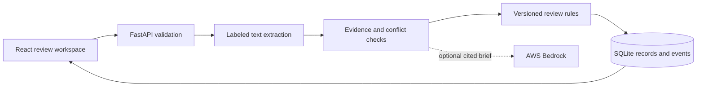

# Sourceline

A commercial-property submission review workbench. Independent portfolio project, synthetic records, no carrier affiliation.

**Python · React · TypeScript · SQL · optional AWS Bedrock**

Review broker documents, inspect source-linked facts, spot inconsistent values, and save a human review with an exportable audit history. Read [the project research notes](docs/RESEARCH.md) for the domain rationale and dependency decisions.

## Run on Windows

Requires Python 3.13 or later and Node.js 22.12 or later, with npm on PATH. From this folder:

```powershell
.\start.ps1
```

The script creates a project-local Python environment, installs the locked dependencies, builds the frontend and starts the app at **http://127.0.0.1:8017**. Open that URL. Use `-Port 8020` to choose another port. Press Ctrl+C to stop. First setup requires internet access; ordinary use is local.

After setup, start directly without rebuilding:

```powershell
.\.venv\Scripts\python.exe -m uvicorn backend.main:app --host 127.0.0.1 --port 8017
```

On macOS/Linux:

```sh
python3 -m venv .venv
.venv/bin/python -m pip install -r requirements.txt
npm --prefix frontend ci
npm --prefix frontend run build
.venv/bin/python -m uvicorn backend.main:app --host 127.0.0.1 --port 8017
```

## Three-minute demonstration

1. Open the review queue and select a submission with a conflicting value. Click its evidence to compare the original document lines. Conflicting amounts do not silently enter portfolio totals.
2. Try to mark an incomplete submission ready. The server rejects it, even if a caller bypasses the interface.
3. Review a clean submission, enter your name and a reason, then save **Ready**. This means ready for the next review step, not approved coverage.
4. Open its history and export its JSON review package. Reload the app to demonstrate persisted status. A stale browser version cannot overwrite a newer review.
5. Import a synthetic sample or a labeled `.txt` document and inspect the resulting facts and checks. Use Portfolio to inspect known exposure by occupancy and review status.

## Input format

The default extractor reads labeled text. It is deterministic, not an LLM or general PDF/OCR parser. See `samples/` or choose a built-in sample in the app. Each field is linked to its document and one-based source line. "Source matched" means the value was found in the text, not independently verified in the real world.

```text
Insured: Example Manufacturing LLC
Broker: Example Broker
Location: Columbus, OH
Occupancy: Light manufacturing
Total insured value: $12,000,000
Requested limit: $8,000,000
Year built: 2005
Sprinklered: Yes
Loss count (5 years): 1
Total losses (5 years): $40,000
```

Amounts are nonnegative whole USD dollars, with positive insured values and requested limits. Duplicate facts must agree. Invalid or missing values remain visibly unresolved. The demo rules are illustrative and versioned; they are not any carrier's risk appetite, and they are not insurance advice.

## How it is built



The API serves the compiled frontend on the same origin. Documents and findings persist together; review updates use transactions and version checks. The audit history is append-only through the application, not tamper-proof against someone who owns the database. Reviewer names are self-declared in this local demo.

Open `/docs` for the generated API reference. All product endpoints are under `/api`; `/api/health` reports readiness and processing mode.

## Check the project

```powershell
.\.venv\Scripts\python.exe -m unittest discover -s backend -p 'test_*.py' -v
npm --prefix frontend run build
```

See [the validation record](docs/VALIDATION.md) for tests actually run and limitations. No performance claims are made about production insurance systems.

## Optional Bedrock brief

The default parser remains the authority for facts and findings. An optional Bedrock call selects up to five existing fields to highlight; the server renders their values and evidence. Model-generated prose cannot change the data or review decision. This is a bounded cloud integration, not general document extraction.

Install `requirements-aws.txt`, configure AWS credentials through the standard SDK credential chain, and set `BEDROCK_MODEL_ID` to a Claude model or inference profile available to your account. Set `AWS_REGION` as appropriate. Use `extractor: "bedrock"` in `POST /api/submissions` to request the brief. This makes a paid AWS request using structured submission fields; enable it only with authorized data. The default UI uses local deterministic processing.

```powershell
.\.venv\Scripts\python.exe -m pip install -r requirements-aws.txt
$env:AWS_REGION = 'us-east-1'
$env:BEDROCK_MODEL_ID = 'your-enabled-model-or-inference-profile-id'
```

AWS credentials and cloud model access are not included. A failed or malformed provider response returns an error and leaves the submission unsaved, so the caller can retry locally. Live AWS behavior is listed separately from local validation.

## Boundaries

This is a local portfolio application for synthetic information. It has no enterprise login or verified reviewer identity, OCR, real carrier integration, actuarial pricing, or multi-user authorization. Keep it bound to loopback. Add those capabilities only for a real requirement, with authorized data and appropriate infrastructure. No cloud service runs in the default path.

SQLite keeps the demo easy to run. A shared deployment would need identity, authorization, secure document retention and a server database such as PostgreSQL before using real submissions. The project demonstrates engineering decisions and a business workflow; it is not a production insurance system.
